# Solution — Webhook Ingestion Reliability

Design rationale for a webhook ingestion service that stays correct under:

- duplicate webhook deliveries
- **concurrent** duplicate deliveries
- worker crashes mid-job
- process restarts and deploys
- stale, abandoned in-flight jobs
- graceful and unclean shutdowns
- multiple worker instances competing for the same work

The provider uses **at-least-once delivery**. The core design principle follows from that:

> **Delivery can happen many times, but business effects must be applied exactly once.**

PostgreSQL is used as the **correctness boundary**; asynchronous recording processing keeps the webhook request path lightweight.

---

## Contents

| § | Section |
|---|---|
| 1 | [Architecture Overview](#1-architecture-overview) |
| 2 | [Failure Modes Addressed](#2-failure-modes-addressed) |
| 3 | [Idempotent Webhook Ingestion](#3-idempotent-webhook-ingestion) |
| 4 | [Database-Level Deduplication](#4-database-level-deduplication) |
| 5 | [Why Not `EventExists()` + `InsertEvent()`?](#5-why-not-eventexists--insertevent) |
| 6 | [The Atomic Ingestion Transaction](#6-the-atomic-ingestion-transaction) |
| 7 | [Durable Recording Jobs](#7-durable-recording-jobs) |
| 8 | [Safe Concurrent Job Claiming](#8-safe-concurrent-job-claiming) |
| 9 | [Worker Crash Recovery](#9-worker-crash-recovery) |
| 10 | [Atomic Job Completion](#10-atomic-job-completion) |
| 11 | [End-to-End Flows](#11-end-to-end-flows) |
| 12 | [Shutdown Behaviour](#12-shutdown-behaviour) |
| 13 | [PostgreSQL vs Redis for Idempotency](#13-postgresql-vs-redis-for-idempotency) |
| 14 | [Testing Strategy](#14-testing-strategy) |
| 15 | [Scaling to 10,000 Webhooks/sec](#15-scaling-to-10000-webhookssec) |
| 16 | [Design Invariants](#16-design-invariants) |
| 17 | [Trade-offs & Known Limits](#17-trade-offs--known-limits) |
| 18 | [Design Decisions at a Glance](#18-design-decisions-at-a-glance) |

---

## 1. Architecture Overview

The system has three responsibilities.

**Webhook ingestion** — accept the webhook, atomically deduplicate it, persist the event, persist call state, update account statistics, and create a durable recording job.

**Recording processing** — background workers claim durable jobs; PostgreSQL prevents two workers claiming the same active job; stale jobs are reclaimable after worker failure.

**Completion** — the job is marked `processed` and the call is marked `recording_processed = true`, atomically.

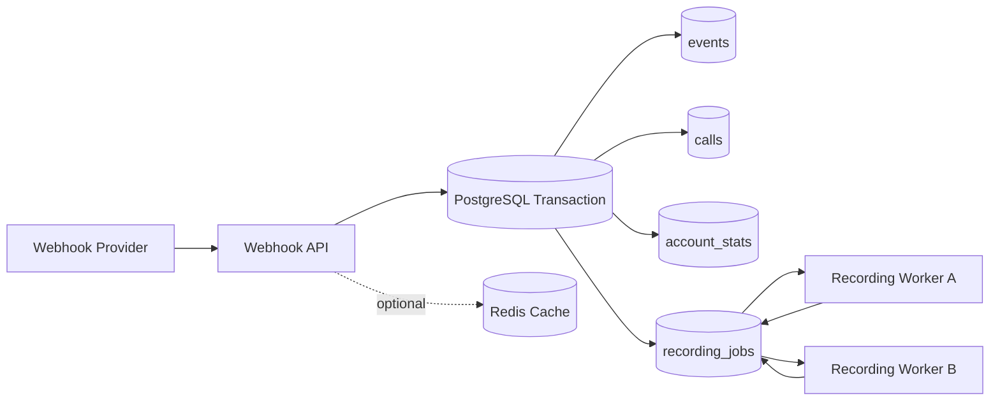

PostgreSQL owns durable state and correctness. Redis is a cache/optimisation layer and is **not** the source of truth for event idempotency.

---

## 2. Failure Modes Addressed

| Failure mode | Solution |
|---|---|
| Duplicate webhook delivered | `ON CONFLICT (event_id) DO NOTHING` |
| Concurrent duplicate delivery | PostgreSQL unique constraint + atomic insert |
| Duplicate business side effects | Side effects run only after a successful event insertion |
| Recording work lost after restart | Durable `recording_jobs` table |
| Two workers process the same job | `FOR UPDATE SKIP LOCKED` |
| Worker crashes after claiming a job | `processing_at` enables stale-job recovery |
| `calls` and `recording_jobs` disagree | Atomic completion transaction |
| Background worker survives shutdown | Dedicated worker context, explicitly cancelled |
| Redis unavailable | Correctness unaffected — it lives in PostgreSQL |

---

## 3. Idempotent Webhook Ingestion

### The problem

At-least-once delivery means the provider will resend:

```
Provider
   |
   +---- event_id = abc123 ----> API
   |
   +---- event_id = abc123 ----> API
   |
   +---- event_id = abc123 ----> API
```

All three requests represent **one** logical event.

Without deduplication, each delivery independently applies side effects:

```
delivery 1 --> increment statistics --> upsert call --> create recording job
delivery 2 --> increment statistics --> upsert call --> create recording job   ← wrong
delivery 3 --> increment statistics --> upsert call --> create recording job   ← wrong
```

Account statistics get inflated and the same recording is queued repeatedly. Worse, this corruption is **silent** — nothing errors, the numbers are just wrong.

---

## 4. Database-Level Deduplication

The `events` table carries a uniqueness constraint on `event_id`. Ingestion opens with:

```sql
INSERT INTO events (
    event_id,
    call_id,
    account_id,
    payload
)
VALUES ($1, $2, $3, $4)
ON CONFLICT (event_id) DO NOTHING
RETURNING TRUE;
```

Deduplication is performed by **PostgreSQL itself**, not by application logic.

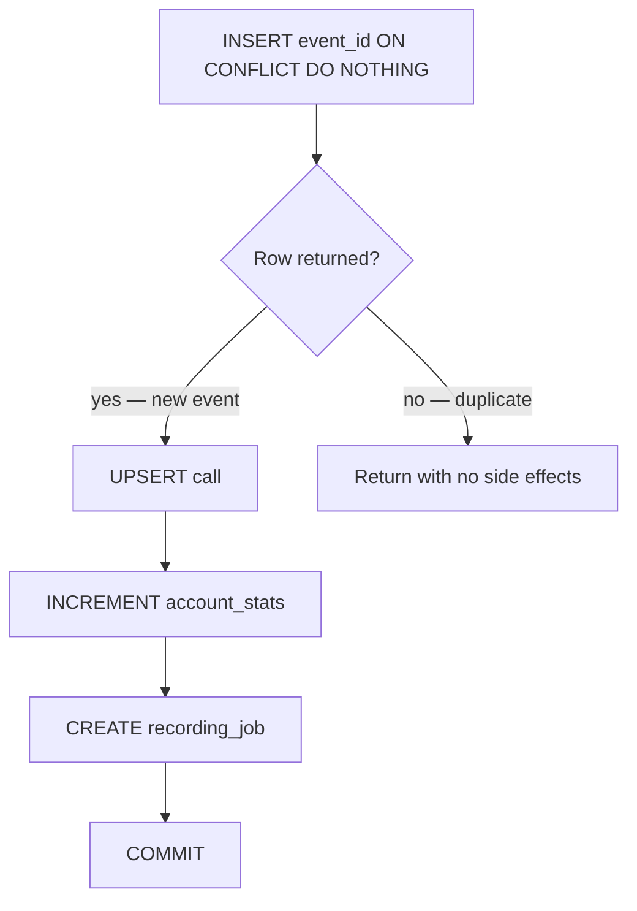

The returned row is the **ownership token**: exactly one transaction can ever receive it for a given `event_id`, and only that transaction applies the business effects.

---

## 5. Why Not `EventExists()` + `InsertEvent()`?

The naive implementation:

```
EventExists(eventID)  →  does not exist  →  InsertEvent(eventID)
```

This introduces a race. Two requests can interleave:

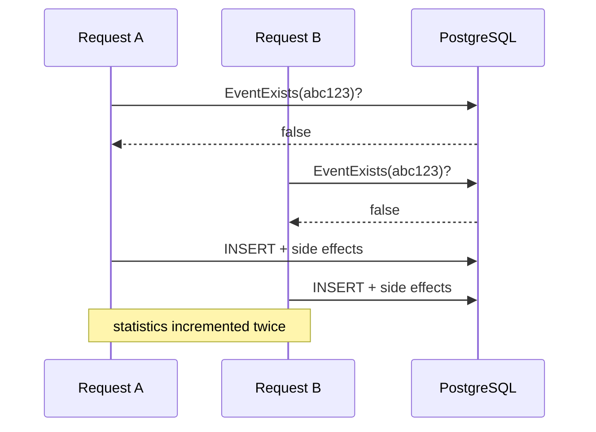

Both requests legitimately observe "does not exist" before either commits. This is a **time-of-check to time-of-use** bug, and it needs no unusual timing to fire — provider retry storms and load-balanced instances make it routine.

The database constraint removes the window entirely:

```
Request A ----\
               PostgreSQL unique index  →  exactly one winner
Request B ----/
```

`ON CONFLICT` collapses check and insert into a **single atomic statement**. Under contention, PostgreSQL blocks the second insert until the first transaction resolves, then applies the conflict action. This is correct at the default `READ COMMITTED` isolation level — no advisory locks, no `SERIALIZABLE` retry loops, no distributed lock service.

> The database constraint, not an application-level check, is the idempotency boundary.

---

## 6. The Atomic Ingestion Transaction

A new webhook touches four tables: `events`, `calls`, `account_stats`, `recording_jobs`. These must not partially succeed — a call updated without its statistics, or statistics incremented without a recording job, is corruption that no retry will fix.

All four writes therefore share one transaction:

```
BEGIN
   |
   +--> INSERT event       ✓
   +--> UPSERT call        ✓
   +--> account_stats      ✗   ← anything fails
   |
   v
ROLLBACK — database returns to its previous consistent state
```

Because the failed event was rolled back too, the provider's next redelivery is treated as brand new and the whole unit is retried cleanly. **Failure and retry are the same code path.**

---

## 7. Durable Recording Jobs

Recording processing is deliberately asynchronous. The webhook endpoint must not wait on:

```
download recording  →  transcode  →  upload/process
```

Instead the webhook commits a durable job row:

```
recording_jobs
-------------------------
call_id
recording_url
status          -- pending → processing → processed
created_at      -- claim ordering (FIFO)
processing_at   -- when claimed; drives staleness detection
processed_at    -- completion timestamp
```

### Lifecycle

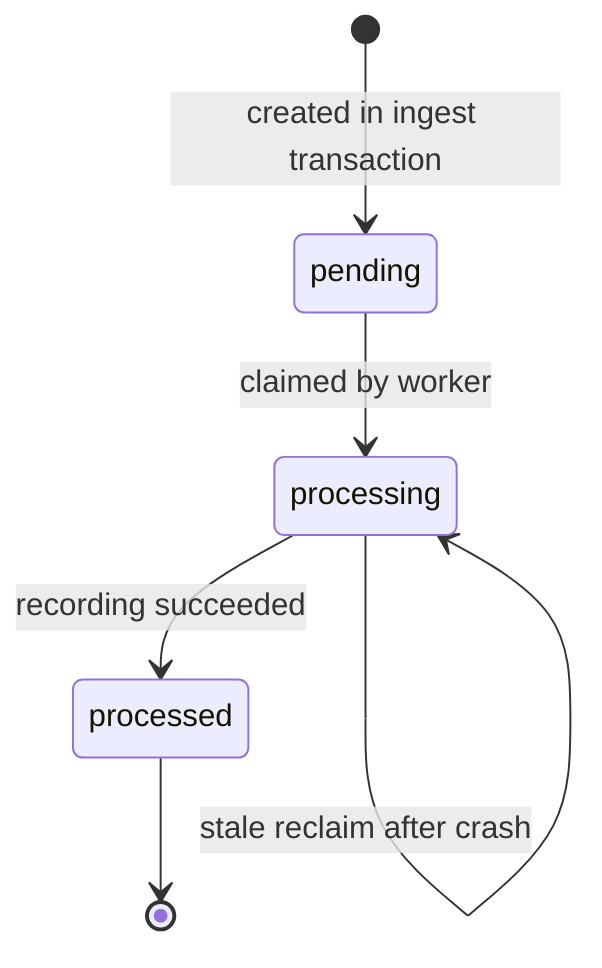

### Why durable rather than in-memory?

An in-memory queue dies with the process:

```
Webhook --> Memory Queue --> Worker
                  X
                  |
                  v
                LOST
```

A database-backed queue does not:

```
Webhook --> PostgreSQL --> recording_jobs --> Worker
                                |
                          worker crashes
                                |
                                v
                    job still present, reclaimable
```

This converts recording processing from *"best-effort background work"* into *"durable asynchronous work"* — the distinction that separates a demo from a service.

---

## 8. Safe Concurrent Job Claiming

Multiple instances run recording workers, all polling the same table:

```
Instance A --> Worker A ----\
Instance B --> Worker B -----> recording_jobs
Instance C --> Worker C ----/
```

A plain `SELECT ... WHERE status = 'pending'` is not enough — every worker sees the same rows and claims them all.

### The claim query

```sql
SELECT call_id, recording_url
FROM recording_jobs
WHERE status = 'pending'
   OR (
       status = 'processing'
       AND processing_at < now() - interval '1 minute'
   )
ORDER BY created_at
FOR UPDATE SKIP LOCKED
LIMIT $1;
```

### How `SKIP LOCKED` prevents duplicate claims

Worker A locks Job 1. Worker B sees the lock and **skips** it rather than waiting:

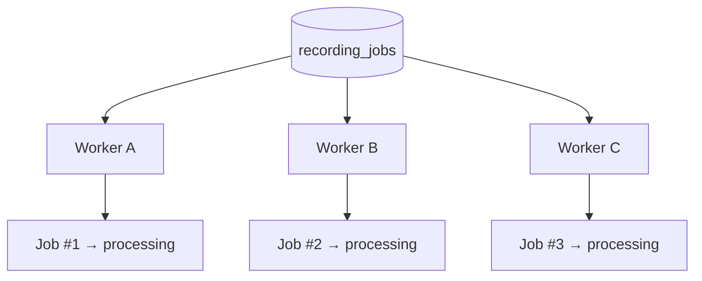

Without `SKIP LOCKED`, workers B and C would **block** on Job 1 and the effective concurrency of the whole fleet would be 1 — a lock convoy dressed up as a worker pool.

### Claiming and status update are atomic

```sql
BEGIN;

SELECT ... FOR UPDATE SKIP LOCKED;

UPDATE recording_jobs
   SET status = 'processing',
       processing_at = now();

COMMIT;
```

The row lock holds for the duration of the transaction, so no other worker can claim the same row in the window between select and update. After commit, the worker owns the job — and critically, a job can never be handed out without `processing_at` being set, which is what makes staleness detection trustworthy.

### Query design details

| Clause | Why |
|---|---|
| `ORDER BY created_at` | Approximate FIFO — old recordings aren't starved by new arrivals |
| `LIMIT $1` | Bounded batches cap how much work one dying worker can strand |
| `status = 'pending' OR stale` | Claim and recovery are the **same** query — no separate reaper needed |

**Supporting index:**

```sql
CREATE INDEX ON recording_jobs (status, created_at);
```

---

## 9. Worker Crash Recovery

A worker can die after claiming a job:

```
pending  -->  processing  -->  X worker crashes
```

Without recovery the row sits in `processing` forever — silently, with no error surfaced anywhere.

`processing_at` records the claim time, which makes the abandoned state **detectable**:

```
processing_at = 10:00
current time  = 10:02
elapsed       = 2 minutes  >  1 minute threshold  →  stale
```

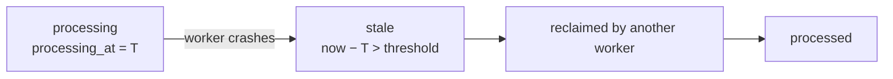

### Two complementary recovery paths

**1. Claim-time recovery** — the claim query in §8 already matches stale rows, so any worker reclaims them as part of normal polling. No extra process, no scheduler.

**2. Explicit recovery** — stale jobs can also be reset to `pending` with a configurable timeout:

```sql
UPDATE recording_jobs
   SET status = 'pending',
       processing_at = NULL
 WHERE status = 'processing'
   AND processing_at < now() - ($1 * interval '1 second');
```

This makes the timeout tunable per environment and gives operators an explicit lever.

### Choosing the threshold

| Threshold | Risk |
|---|---|
| Too short | A healthy-but-slow job is reclaimed while still running → duplicate processing |
| Too long | Real crashes take longer to recover → recordings sit idle |

The threshold should sit comfortably above p99 processing time. For long or highly variable workloads, the better long-term answer is a **worker heartbeat** that periodically refreshes `processing_at` — decoupling *"still alive"* from *"started recently"*.

### Consequence worth stating plainly

Because stale jobs can be reclaimed, recording processing is **at-least-once**, not exactly-once. Downstream recording work should therefore be idempotent or safely overwritable (deterministic output keys, for example). This is a deliberate trade: the alternative is silently dropping recordings on every crash, which is strictly worse.

Note the asymmetry — **account statistics are exactly-once** (guarded by the unique constraint), while **recording side effects are at-least-once** (guarded by retry). Each guarantee is matched to what the operation can tolerate.

---

## 10. Atomic Job Completion

A successful recording updates two pieces of durable state:

```sql
BEGIN;

UPDATE recording_jobs
   SET status = 'processed',
       processed_at = now()
 WHERE call_id = $1;

UPDATE calls
   SET recording_processed = TRUE,
       updated_at = now()
 WHERE call_id = $1;

COMMIT;
```

### Why this matters

Without a transaction, a failure between the two statements is permanent:

```
UPDATE recording_jobs   ✓     recording_jobs.status     = 'processed'
UPDATE calls            ✗     calls.recording_processed = false
```

The job says done, the call says not done, and nothing will ever reconcile them — the job is no longer `processing`, so no worker will ever look at it again.

With a transaction, either both land or neither does. If the commit fails, `processing_at` goes stale and the job is retried, which is exactly the desired behaviour.

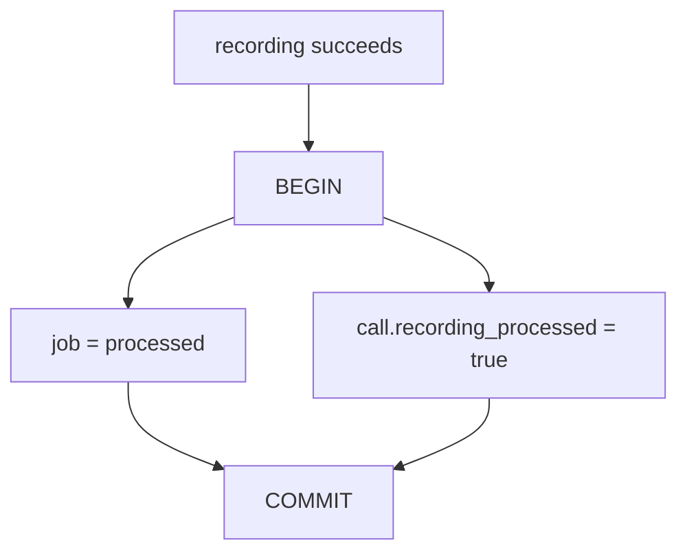

---

## 11. End-to-End Flows

### New webhook

The request path is intentionally small, and the response does not wait for recording work:

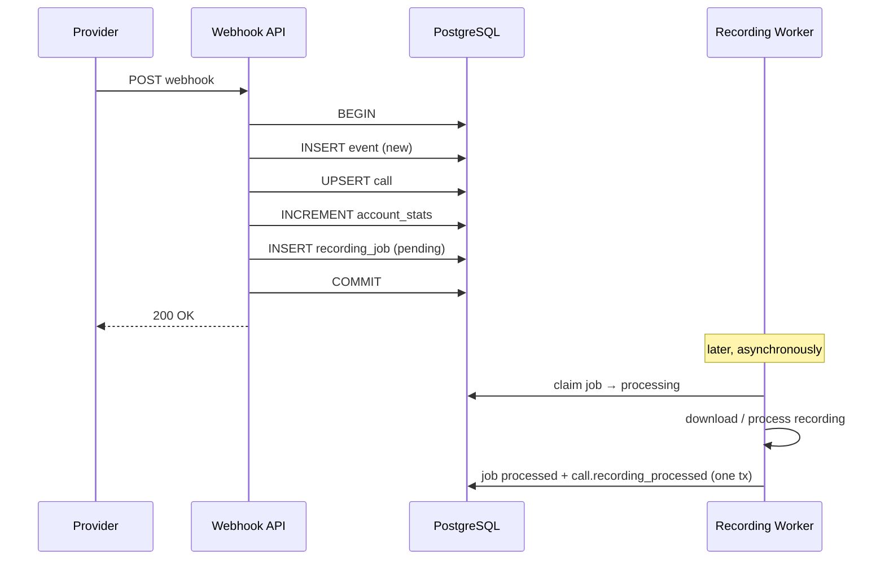

Long-running work happens **after** acknowledgement. This keeps webhook latency low and prevents provider retries caused by slow recording processing — retries that would otherwise amplify load exactly when the system is already struggling.

### Duplicate delivery

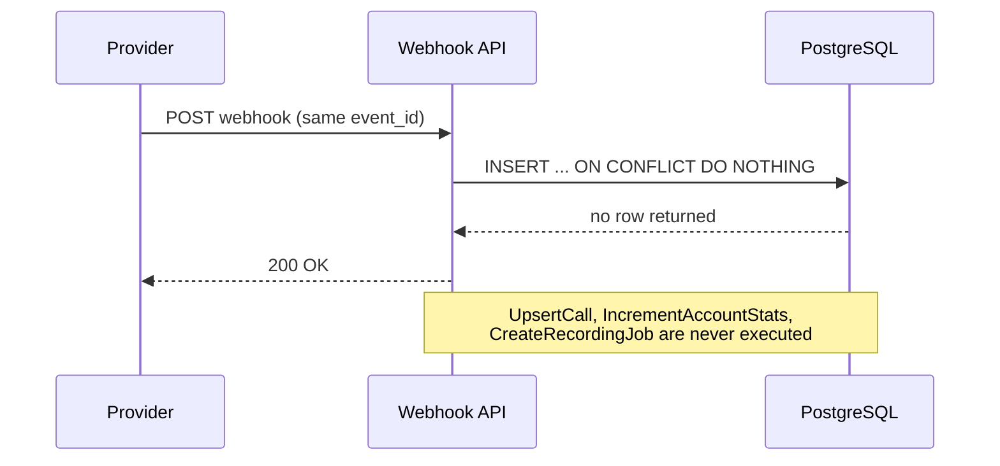

A duplicate is **not an error** — it is the expected behaviour of an at-least-once provider. Returning a non-2xx would only trigger further retries.

### Concurrent duplicate deliveries

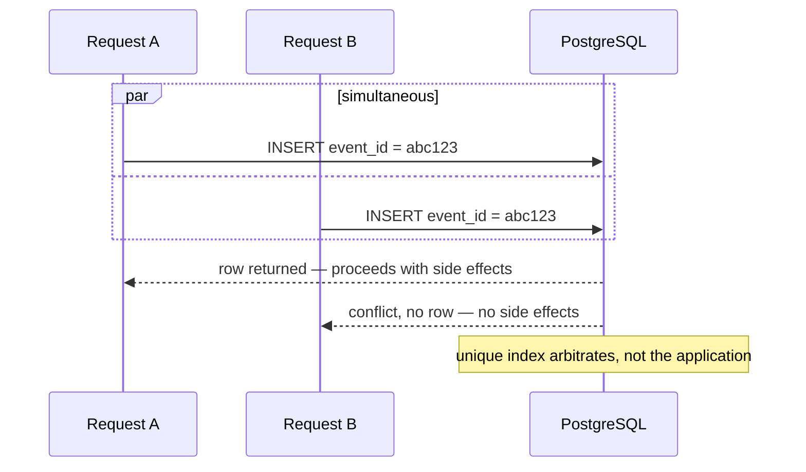

This matters because concurrency **cannot** be reliably controlled at the HTTP layer — not across instances, not behind a load balancer. The database is the final authority.

---

## 12. Shutdown Behaviour

The recording worker runs under its own cancellable context, distinct from any request context:

```go
workerCtx, workerCancel := context.WithCancel(context.Background())
svc.StartRecordingWorker(workerCtx)
```

During shutdown that context is cancelled explicitly, **before** the HTTP server finishes draining:

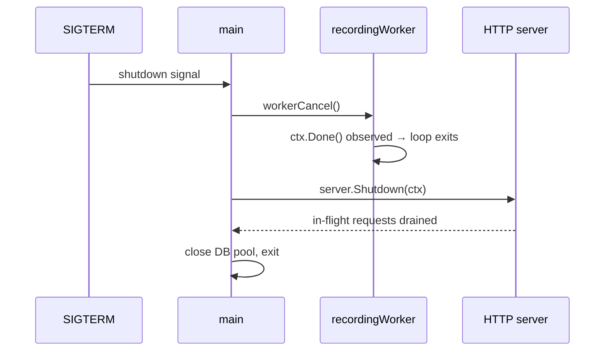

**Why this ordering:** cancelling the worker first stops *new* jobs being claimed while the process is on its way out, so the shutdown window is spent finishing existing work rather than starting more of it. Any job already claimed and not completed simply goes stale and is picked up by another instance — the durability model absorbs it.

---

## 13. PostgreSQL vs Redis for Idempotency

Redis is present in the system, but is deliberately **not** the correctness boundary for deduplication.

| | **PostgreSQL** (chosen) | Redis |
|---|---|---|
| Durability | Durable by design | Primarily a cache |
| Event state | Already stored here | A separate state system |
| Uniqueness | Enforced by unique constraint | Requires hand-rolled `SETNX` + TTL |
| Transactions | Cover dedup **and** business writes | Dedup and writes span two systems |
| Failure surface | One correctness boundary | Multiple failure points |
| Key expiry | None — the ledger is the truth | TTL must outlive the provider's retry window |

A Redis-based approach looks like:

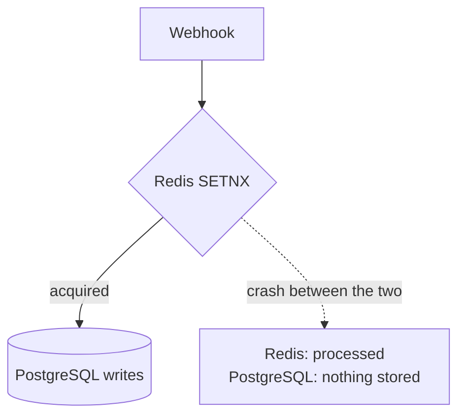

If the process dies after the Redis key is set but before the database commit, the event is marked processed while none of its effects exist — and **every subsequent redelivery is now suppressed**. The event is lost permanently, and nothing reports it.

Defending against that means compensating logic, TTL tuning against the provider's retry schedule, and reconciliation jobs — all to work around a problem the unique index simply does not have.

Redis remains genuinely useful for **caching, rate limiting, hot-path reads, and derived statistics**, and could later serve as a cheap duplicate pre-filter in front of the database. But it would be an optimisation *in front of* the constraint, never a replacement for it.

---

## 14. Testing Strategy

Tests focus on failure modes and correctness properties, not just on individual functions. A passing happy-path suite is precisely what the original service had.

### Idempotency

```
same event delivered repeatedly  →  exactly one event stored
```

- `TestDuplicateDeliveryIsIgnored`
- `TestConcurrentDuplicateDeliveryIsIdempotent`

### Recording processing

```
webhook  →  pending  →  processing  →  processed
```

- `TestRecordingWorkerProcessesDurableJob`
- `TestRecordingIsMarkedProcessed`

### Stale job recovery

```
processing  →  (worker crashes)  →  stale  →  reclaimed  →  processed
```

- `TestRecordingWorkerProcessesStaleJob`

### Store-level tests

Event insertion, account statistics, call updates, job claiming, duplicate-claim prevention, processed state, and processed timestamps.

### Test matrix

| Scenario | Expected result |
|---|---|
| New webhook | Event stored, side effects applied |
| Duplicate webhook | Ignored, still returns 2xx |
| Concurrent duplicate webhook | Stored once, counted once |
| Recording URL present | Durable job created as `pending` |
| Worker claims job | `pending → processing`, `processing_at` set |
| Active processing job | Not reclaimed while fresh |
| Stale processing job | Reclaimable |
| Successful recording | `processing → processed` |
| Successful completion | `calls.recording_processed = true` |
| Worker restart | Durable jobs remain and resume |
| Fresh database | Full suite passes |

### Clean-slate verification

```bash
docker compose down -v          # destroy volumes
docker compose up -d --build    # fresh PostgreSQL + Redis, rebuilt service
go test ./...                   # PASS
```

This matters because it proves the behaviour does not depend on previously persisted state or a hand-patched local schema — the migrations alone produce a correct system.

---

## 15. Scaling to 10,000 Webhooks/sec

The correctness model stays unchanged; the architecture around it evolves. A durable queue is introduced between ingestion and heavy asynchronous processing:

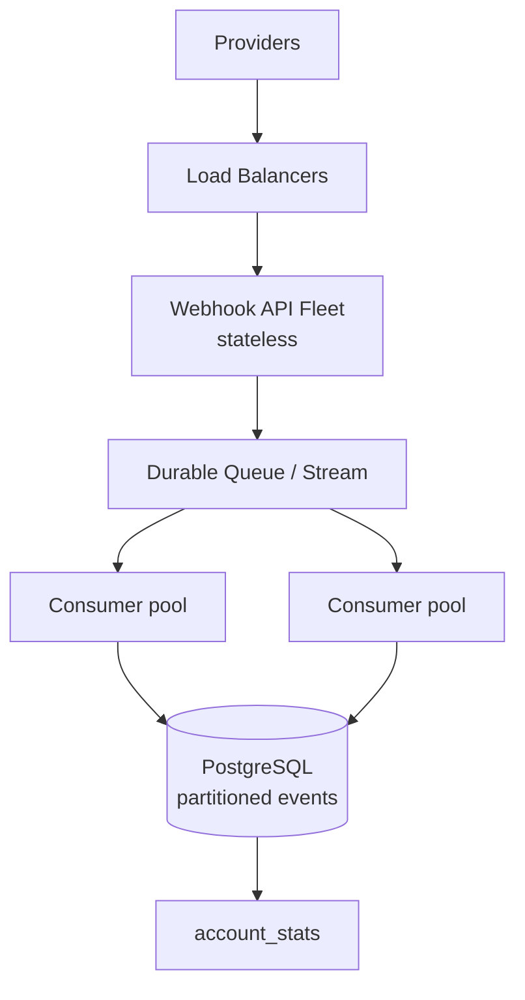

The webhook API does the minimum synchronous work needed to **durably accept** the event, acknowledges the provider, and lets consumers apply business effects asynchronously.

| Area | Approach |
|---|---|
| Ingest | Stateless API instances behind load balancers; durable queue absorbs bursts |
| Storage | Time-partition `events`; drop old partitions cheaply; index deliberately — every index is a write-path cost |
| Write efficiency | Batch inserts; aggregate statistics rather than per-event row increments, to avoid hot-counter contention |
| Flow control | Backpressure at ingest, bounded worker concurrency, connection-pool tuning |
| Resilience | Retry policies, dead-letter handling for poison jobs |
| Observability | Ingestion latency, duplicate rate, queue depth, job age, failure rate, tracing |
| Redis | Duplicate pre-filter and hot-path caching, constraints still owning correctness |

The invariant does not change at any scale:

> An event may be **delivered** many times, but its business effects must be **applied exactly once**.

---

## 16. Design Invariants

The implementation rests on five invariants.

**1 — Event uniqueness**
```
event_id  →  at most one events row
```
Enforced by PostgreSQL.

**2 — Business effects only follow successful insertion**
```
duplicate event  →  X  →  no business effects
```

**3 — A job has exactly one active owner**
```
job  --> Worker A   ✓
     X-> Worker B
```
Enforced by row locks and `SKIP LOCKED`.

**4 — Stale work is recoverable**
```
status = 'processing' AND old processing_at  →  reclaim
```

**5 — Completion is atomic**
```
recording_jobs = processed   +   calls.recording_processed = true
```
Both committed together, or neither.

---

## 17. Trade-offs & Known Limits

Being explicit about what this design does *not* do:

- **Recording processing is at-least-once.** Stale reclaim can reprocess a job whose worker was slow rather than dead. Mitigated by a generous threshold; properly solved by heartbeats.
- **Polling, not push.** Workers poll rather than being notified, adding latency equal to the poll interval. `LISTEN/NOTIFY` would cut that at the cost of more moving parts.
- **`events` grows unbounded.** Fine at current volume; needs partitioning and a retention policy before it isn't.
- **No dead-letter path.** A permanently failing recording is reclaimed indefinitely. A retry counter with a `failed` terminal state would bound this and make poison jobs visible.
- **Statistics contend on hot rows.** Acceptable now; per-account counter updates become a bottleneck under heavy concurrency. Batched or sharded counters are the standard answer.
- **No ingest rate limiting.** The database is currently the only backpressure mechanism.

---

## 18. Design Decisions at a Glance

**`ON CONFLICT` over check-then-insert** — eliminates the time-of-check/time-of-use race between concurrent redeliveries, with no locks and no elevated isolation level.

**PostgreSQL over Redis for idempotency** — keeps deduplication and business side effects inside one consistency boundary; no window where two stores disagree.

**`FOR UPDATE SKIP LOCKED`** — real parallelism across workers with no duplicate ownership and no lock convoy.

**`processing_at`** — a durable record of *when* a worker claimed a job, which is what makes abandonment detectable.

**Stale-job reclamation** — worker crashes become recoverable without any external queue or scheduler.

**Durable `recording_jobs`** — asynchronous work survives process restarts and deploys.

**Transactions per unit of meaning** — ingest (event + call + stats + job) and completion (job + call) each commit atomically, so no two tables can permanently disagree.

**Dedicated worker context** — background processing stops deliberately during shutdown rather than being torn down mid-flight.

---

The resulting system provides idempotent webhook ingestion, atomic business effects, durable asynchronous processing, safe concurrent workers, automatic crash recovery, atomic completion, controlled shutdown, and a clear path to horizontal scaling.

The central principle:

> **Use PostgreSQL to define correctness, and asynchronous workers to provide throughput.**